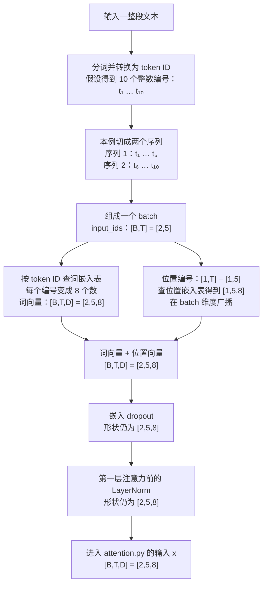
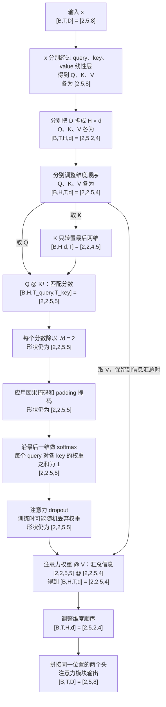
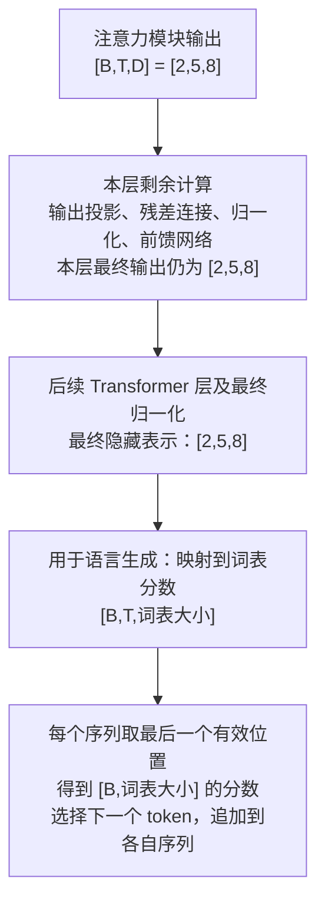

# GPT-2 第一课笔记：从文本、batch 到多头注意力

整理日期：2026-09-24

这份笔记记录已讨论的概念和完整数据流程，供阅读代码时对照。所有小尺寸都是教学示例，不是预训练 GPT-2 的实际配置。核心代码仍由学习者亲自实现。

## 1. 先分清 token、序列和 batch

- **token（词元）**：分词器产生的文本片段，可以是词、词的一部分或标点；token ID 是它在词表中的整数编号。
- **序列（sequence）**：按顺序排列的一组 token，是模型这次处理的一个样本。它可以是一句话、一段话，也可以是长文章的一段切片。
- **batch（批次）**：一次放在一起处理的一组序列。`B` 是一个 batch 中的序列数，不是 batch 的个数。

分词、切分序列、组成 batch 是三个不同的操作。长文本可能需要切成长度合适的序列；组成 batch 则是在这些样本中选取若干个一起处理。序列也可以来自不同文章。

假设一段文本经过分词，恰好得到 10 个 token，记为 `t₁ … t₁₀`。这只是一个假设长度，不代表实际分词器一定这样切分。

| 处理方式 | 数据组织 | token ID 形状 |
|---|---|---|
| 整段作为一个序列 | 一行放全部 10 个 token | `[B,T] = [1,10]` |
| 切成两个序列，再组成一个 batch | 两行，每行 5 个 token | `[B,T] = [2,5]` |

长度允许时，整段文本完全可以作为一个序列，用 `B=1` 处理。不是必须把一段话拆成多个 batch。

**在本项目的注意力中，batch 不同行之间不互相读取。** 如果把前半段和后半段放在不同的序列中，后半段不会仅仅因为它们在同一个 batch，就获得前半段的上下文。切分方式会影响可用上下文。

## 2. 为什么 batch 便于设备并行计算？

batch 把许多互不依赖、使用相同计算规则的任务，组织成一个规则的张量。PyTorch 的底层算子可以整体处理这个张量，再由计算库和硬件安排并行执行。

它不是“给数据加一个 batch 标签，计算就自动变快”，而是让这些独立任务以适合批量运算的形式交给设备。

例如，对两个序列生成 Q：

```text
序列 1 的输入 X₁：[5,8] → 使用 query 的同一组参数 → Q₁：[5,8]
序列 2 的输入 X₂：[5,8] → 使用 query 的同一组参数 → Q₂：[5,8]
```

这两项计算互不依赖：算 Q₂ 不需要先知道 Q₁。把输入叠成 `[2,5,8]` 后，可以一次交给同一个线性层，得到 `[2,5,8]` 的 Q。

就线性层这一步而言，可以把它理解为：把共 10 个 token 向量视为一张 `[10,8]` 的表，统一进行矩阵运算，再按原来的序列组织输出。这是理解计算的方式，并不要求你手动展平输入，也不描述某个后端必定采用的实现。

**注意力计算仍要保留序列边界。** 不能把这 10 个 token 合成一个序列计算注意力，否则不同样本就会相互读取，改变任务含义。

PyTorch 的矩阵乘法支持把最后两维视为矩阵、前面的维度视为批量维度。因此 `[B,H,T,d]` 与 `[B,H,d,T]` 相乘时，每个序列的每个头分别计算自己的匹配矩阵。[PyTorch 2.8：torch.matmul](https://docs.pytorch.org/docs/2.8/generated/torch.matmul.html)

设备拥有多个计算单元，可以把这些独立的运算分配出去；较大的批量运算通常也更容易充分利用硬件、减少逐样本调用的开销。CPU 可以利用向量运算和多线程，GPU 擅长大规模并行矩阵运算。具体速度取决于硬件、算子、张量大小和可用内存，`B=2` 不保证恰好快两倍。PyTorch 的性能指南也说明，合适的 batch 大小有助于提高设备利用率。[PyTorch 性能指南](https://docs.pytorch.org/tutorials/recipes/recipes/tuning_guide.html)

`B=1` 时，单个序列内部的矩阵运算也可以并行。batch 增加了可以一起安排的独立计算量，并不是并行计算的唯一来源。

训练时，通常会汇总一批有效样本或 token 的损失来计算梯度、更新共享参数。生成时，也可以批量续写多个序列，但每个序列新生成的 token 仍然依赖前一步的结果。

## 3. 本笔记统一使用的维度

| 符号 | 含义 | 示例值 |
|---|---|---:|
| `B` | 一个 batch 中的序列数 | 2 |
| `T` | 每个序列的 token 位置数；有补齐时包含补齐位置 | 5 |
| `D` | 每个位置的完整隐藏特征维度 | 8 |
| `H` | 注意力头数 | 2 |
| `d` | 每个头的特征维度，`d = D/H` | 4 |

`D` 和 `d` 都是在数一个向量里有多少个特征数值。每个头都包含所有 token 位置；拆头拆的是特征维度，不是把 token 分给不同的头。

## 4. 模型初始化与每次输入的计算

模型先准备参数，再使用这些参数处理输入。

| 参数 | 示例形状 | 用途 |
|---|---|---|
| 词嵌入表 | `[词表大小,8]` | 根据 token ID 查出向量 |
| 位置嵌入表 | `[最大位置数,8]` | 根据位置编号查出向量 |
| query 线性层 | 权重 `[8,8]`，偏置 `[8]` | 生成 Q |
| key 线性层 | 权重 `[8,8]`，偏置 `[8]` | 生成 K |
| value 线性层 | 权重 `[8,8]`，偏置 `[8]` | 生成 V |

从头训练时，这些权重通常随机初始化；使用预训练模型时，则加载学好的参数。偏置和归一化等参数也有各自的初始化规则。

**换输入、换 batch，不会重新初始化模型参数。** 前向计算使用当前参数；训练通过梯度更新参数。Q、K、V 是当前输入经过线性层算出的结果，不是三组固定参数。

同一个线性层中，每个输出特征都有一组针对全部输入特征的权重；不同 token 位置共享这组计算规则。query、key、value 三个线性层之间则各有各的参数。

本例每个线性层输入 8 个数、输出 8 个新数。形状相同，但数值发生了变换；每个输出特征都可以使用全部 8 个输入特征。

## 5. 流程图一：从整段文本到注意力输入

本例选择把 10 个 token 切成两个长度为 5 的序列，再把它们放入一个 batch。这是为说明维度选用的处理方式，并非本项目所有数据都固定如此切分。



本例位置编号为 `0,1,2,3,4`。两个独立序列分别使用这些位置编号。词向量与位置向量逐元素相加，不是拼接，所以特征维度仍为 8。

若同一 batch 中的序列长短不一，可以补齐到相同长度，并记录哪些位置是真实内容。后续层的注意力输入来自前一层输出及归一化，不会在每层重新把 token ID 查一次词嵌入表。

## 6. 流程图二：一个注意力模块内部



### Q、K、V 在哪里产生？

在线性变换后就已经产生。`transform` 中的变量名 `proj` 是通用名字：传入 query 层时装的是 Q，传入 key 层时装的是 K，传入 value 层时装的是 V。后续 `rearrange` 只拆头、调整维度顺序。

- Q：用于发起匹配。
- K：用于被匹配。
- V：提供最终被加权汇总的信息。

多头使同一序列可以计算多套注意力。每个头都处理全部位置，但使用不同的投影特征；具体关注模式通过训练形成，不预先指定每个头负责某种语法关系。

### 匹配分数与缩放

单个头中，Q 的形状是 `[T,d]`，K 转置后是 `[d,T]`，相乘得到 `[T,T]`。

分数表中 `(i,j)` 表示第 i 个位置的 query 与第 j 个位置的 key 的点积。行是 query 位置，列是 key 位置。加回序列数和头数，完整分数形状为 `[B,H,T,T]`。

点积是对应特征相乘再相加，例如 `[1,2]` 与 `[3,4]` 的点积为 `1×3 + 2×4 = 11`。随后除以 `√d`，帮助控制分数尺度；本例 `d=4`，除以 2。缩放不改变形状和分数大小顺序。

### 两种掩码

| 掩码 | 屏蔽依据 | 本例可用的形状 |
|---|---|---|
| 因果掩码 | query 不能读取未来的 key 位置 | `[T,T] = [5,5]`，广播到 batch 和头 |
| padding 掩码 | 不能把人为补齐的位置当作信息来源 | `[B,1,1,T] = [2,1,1,5]` |

当前位置可以读取自身，因为它已经是已知输入；但自身的注意力权重不一定高。

分词器输出的 padding 标记通常为 `[B,T]`，真实位置是 1，补齐位置是 0。本项目在传入 `attention()` 前，已将其扩展成可加到分数上的形式：真实位置为 0，补齐位置为 `-10000`。

中间两个维度为 1，表示同一序列的所有头、所有 query 都共享“哪些 key 是补齐位置”这一规则；batch 维度保留各序列自己的规则。本笔记的等长示例没有补齐，因此加性 padding 掩码全为 0。

因果掩码通常将未来位置的分数设为负无穷，使 softmax 后权重为 0。仅把分数设成 0 不能起到同样作用，因为 `exp(0)=1`。padding 掩码屏蔽的是信息来源列，不等于直接删除补齐位置对应的 query 行；训练损失中排除补齐目标是另一件事。

### softmax 与 dropout

softmax 先对分数取指数，再除以该 query 行的指数总和。它沿最后的 key 维度计算，对应 `dim=-1`。

例如分数 `[2,1,-∞,-∞]` 对应的权重约为 `[0.731,0.269,0,0]`。这些是“从不同位置取多少信息”的权重，不是下一个 token 的词表概率。

注意力 dropout 在 softmax 之后、汇总 V 之前。训练时以概率 p 将部分权重置零，并将保留权重除以 `1-p`。因此，softmax 后每行和为 1，但 dropout 后某次计算的行和不一定为 1。评估模式下 dropout 不丢弃、不缩放；`p=0` 时也不改变权重。

### 汇总 V 与合头

单个头的权重 `[T,T]` 乘上 V `[T,d]`，得到输出 `[T,d]`。

其中 `(i,j)` 是输出位置 i 的第 j 个特征，它等于各来源位置 V 的第 j 个特征按权重相加的结果。相加的是不同位置的同一特征列。

合头时，拼接的是同一个 token 位置在不同头中的输出：

```text
头 1：[a,b,c,d]
头 2：[e,f,g,h]
拼接：[a,b,c,d,e,f,g,h]

[B,H,T,d] → [B,T,H,d] → [B,T,D]
[2,2,5,4] → [2,5,2,4] → [2,5,8]
```

先调整维度顺序，再合并 H 和 d。合头是排列、拼接，不再做一次信息加权求和。

## 7. 流程图三：注意力之后到生成 token



本图概括整层流程，没有展开残差支路和前馈网络的中间维度。本项目将注意力之后的输出投影放在 Transformer 层中；`attention()` 返回合头后的结果即可。完整模型由多层这样的结构组成，不是只做一次注意力就直接得到文本。

项目的 `GPT2Model` 前向计算先返回隐藏表示，生成时再做词表映射。训练时通常也会利用各有效位置预测下一 token，并与对应目标计算损失；生成新文本时，每条序列根据最后有效位置选择下一 token，再继续下一轮。

## 8. 阅读项目文件时如何对照

| 文件或函数 | 对应流程 |
|---|---|
| `models/gpt2.py` 的 `embed` | token ID → 词嵌入与位置嵌入相加 |
| `modules/gpt2_layer.py` | Transformer 层，组织归一化、注意力、残差和前馈计算 |
| `modules/attention.py` 的 `__init__` | 准备 Q/K/V 线性层、头数、每头维度及 dropout |
| `modules/attention.py` 的 `transform` | 一路投影 → 拆头 → 调整顺序 |
| `modules/attention.py` 的 `forward` | 分别准备 Q/K/V，再调用 `attention` |
| `modules/attention.py` 的 `attention` | 匹配、缩放、掩码、softmax、dropout、汇总 V、合头 |
| `utils.py` 的 `get_extended_attention_mask` | 把 padding 标记转成可加到分数上的掩码 |

现有 `gpt2-first-steps.py` 直接生成随机输入向量，并调用已有的投影与拆头。它跳过文本、分词、嵌入，也没有执行注意力汇总。脚本实际使用 `B=2,T=4,D=8,H=2`；本笔记特意用 `T=5,d=4`，方便区分位置维度与特征维度。

用户现已完成 `attention()`。新增的 `attention-check.py` 会验证完整注意力模块，检查参考输出、梯度、因果性、padding、batch 独立性与 dropout 行为，使用 CPU 小张量且不需要预训练权重。

## 9. 维度速查表

| 阶段 | 通用形状 | 本笔记示例 |
|---|---|---|
| token ID | `[B,T]` | `[2,5]` |
| 注意力输入 | `[B,T,D]` | `[2,5,8]` |
| 未拆头的 Q/K/V，各自 | `[B,T,D]` | `[2,5,8]` |
| 拆出头维度，各自 | `[B,T,H,d]` | `[2,5,2,4]` |
| 调整顺序后的 Q/K/V，各自 | `[B,H,T,d]` | `[2,2,5,4]` |
| K 的最后两维转置 | `[B,H,d,T]` | `[2,2,4,5]` |
| 匹配分数 | `[B,H,T,T]` | `[2,2,5,5]` |
| 缩放、掩码、softmax、dropout 后 | `[B,H,T,T]` | `[2,2,5,5]` |
| 汇总 V 后 | `[B,H,T,d]` | `[2,2,5,4]` |
| 合头前调整顺序 | `[B,T,H,d]` | `[2,5,2,4]` |
| 合头后输出 | `[B,T,D]` | `[2,5,8]` |

本笔记保留概念、计算关系与维度，不提供完整待实现函数。第一课的 attention 已由学习者分段编写并通过局部验证；后续核心组件仍按理解、亲自实现、检查的顺序推进。
