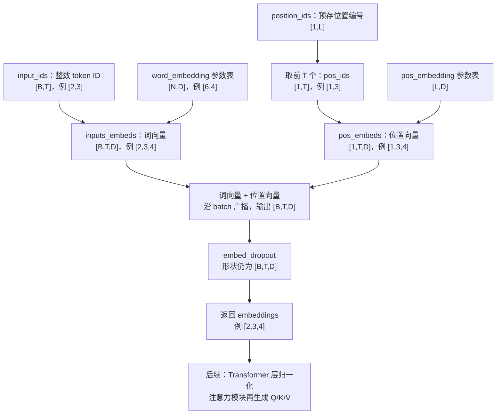

# GPT-2 学习笔记（二）：词元与位置嵌入

更新：2026-09-25。对应实现：[`GPT2Model.embed`](models/gpt2.py)，已完成并通过局部验证。

## 1. 这一部分解决什么问题

分词器输出的是整数 token ID，注意力模块处理的是浮点向量。嵌入负责把每个 ID 换成一个向量，并加入它在序列中的位置信息。

本节沿用以下符号：

| 符号 | 含义 | 示例 |
|---|---|---|
| B | 一个 batch 中的序列数 | 2 |
| T | 每个序列的位置数 | 3 |
| D | 每个 token 的向量维度 | 4 |
| N | 整个词表中的 token 数 | 6 |
| L | 位置表支持的最大长度 | 至少为 T |

B 是一次处理多少个序列，T 是每个序列多长，N 是词表多大。它们表示不同的事情。组成 batch 并不要求把一段话按 B 等分；单独一段文本也可以作为 B=1 的输入。

## 2. 完整流程与维度



`embed` 的输出是带位置信息的向量。此时尚未生成 Q/K/V，也没有计算不同 token 之间的注意力权重。

## 3. 词嵌入是查表

`nn.Embedding(N, D)` 维护一张 `[N,D]` 的参数表。token ID 是这张表的行索引；ID 为 5 就查第 5 号行（索引从 0 开始），不是把数字 5 当作语义特征。

以 N=6、D=4 为例，假设表中两行为：

| token ID | 特征 1 | 特征 2 | 特征 3 | 特征 4 |
|---|---:|---:|---:|---:|
| 2 | 0.2 | -0.1 | 0.5 | 0.3 |
| 5 | -0.4 | 0.7 | 0.1 | -0.2 |

这些数值仅用于演示。输入 `[[2,5,2]]` 的形状是 `[1,3]`，查表后为：

```text
[[[ 0.2, -0.1,  0.5,  0.3],   ← ID 2
  [-0.4,  0.7,  0.1, -0.2],   ← ID 5
  [ 0.2, -0.1,  0.5,  0.3]]]  ← ID 2

形状：[1,3,4]
```

每个 ID 被替换为一个 D 维向量，所以 `[B,T] → [B,T,D]`。输出只包含输入所选的行，没有取出整张词表。

同一 ID 在不同位置、不同 batch 行中查询同一张表，得到相同的原始词向量；加入位置向量和后续上下文计算后，表示可以不同。

## 4. 位置编号也要查表

仅看原始词向量，无法区分示例中两次出现的 ID 2 分别处于哪里。位置嵌入提供这部分信息。

本项目在模型创建时注册：

```python
position_ids = torch.arange(config.max_position_embeddings).unsqueeze(0)
self.register_buffer('position_ids', position_ids)
```

它保存 `[[0,1,2,...]]`，形状为 `[1,L]`。处理长度为 T 的输入时：

```python
pos_ids = self.position_ids[:, :seq_length]  # [1,T]
pos_embeds = self.pos_embedding(pos_ids)     # [1,T,D]
```

`:` 保留第一维，`:seq_length` 只取前 T 个编号。因此 T=3 时，位置编号为 `[[0,1,2]]`。

| 对象 | 内容 | 是否通过训练更新 |
|---|---|---|
| `input_ids` | 当前输入的 token ID | 否，整数索引 |
| `word_embedding.weight` | 每种 token 的 D 维向量 | 是 |
| `position_ids` | 固定的位置编号 | 否，buffer |
| `pos_embedding.weight` | 每个位置的 D 维向量 | 是 |

buffer 会随模型移动到相应设备，但不是需要优化的参数。两张嵌入表在模型初始化时创建，后续每次输入使用同一组参数；训练时更新参数，加载预训练权重时则使用已有参数。

这里采用从 0 开始的连续位置编号，T 不能超过位置表容量 L。

## 5. 为什么位置向量是 [1,T,D]

batch 中各序列都按 `0,1,...,T-1` 编号，因此只需要一份位置向量。相加时由广播规则应用到 B 个序列：

```text
inputs_embeds  [2,3,4]
pos_embeds   + [1,3,4]
              ───────
embeddings     [2,3,4]
```

逐元素的关系是：

```text
embeddings[b,t,j] = 词嵌入表[input_ids[b,t],j] + 位置嵌入表[t,j]
```

这里 j 是特征索引。相加对齐同一个位置、同一个特征，D 保持为 4；如果沿特征维拼接才会变成 8，而本项目使用的是相加。

继续用 `[[2,5,2]]` 举例，假设位置表的三行为：

```text
位置 0：[0.01, 0.02, 0.03, 0.04]
位置 1：[0.10, 0.20, 0.30, 0.40]
位置 2：[0.50, 0.60, 0.70, 0.80]
```

相加结果为：

```text
位置 0，ID 2：[ 0.21, -0.08, 0.53, 0.34]
位置 1，ID 5：[-0.30,  0.90, 0.40, 0.20]
位置 2，ID 2：[ 0.70,  0.50, 1.20, 1.10]
```

两个 ID 2 的词向量相同，但加入的位置向量不同，得到的结果就不同。位置表是可学习的，向量各分量不要求随位置单调增长；这里选择简单数值仅为方便手算。

## 6. 相加之后应用 dropout

```python
embeddings = self.embed_dropout(embeddings)
```

已有的 `self.embed_dropout` 在模型初始化时创建，无需在 `embed` 内重复创建。

- `model.train()`：以概率 p 将部分元素置零，保留的元素乘以 `1/(1-p)`，使每个元素的期望值保持不变。
- `model.eval()`：直接保留输入数值。
- 两种模式下，形状都保持 `[B,T,D]`。

dropout 是对浮点元素的随机处理，不是删掉 token 位置，也不会缩短序列。它与注意力中的 dropout 位于不同步骤：这里处理相加后的嵌入，注意力中处理 softmax 后的权重。

`eval()` 关闭 dropout 的随机丢弃，但不会自动关闭梯度计算；这也是验证脚本能在评估模式下检查梯度的原因。

## 7. 已完成实现回顾

下面按已经保存的 `embed()` 整理，仅精简注释：

```python
def embed(self, input_ids):
    input_shape = input_ids.size()
    seq_length = input_shape[1]

    inputs_embeds = self.word_embedding(input_ids)  # [B,T,D]
    pos_ids = self.position_ids[:, :seq_length]     # [1,T]
    pos_embeds = self.pos_embedding(pos_ids)        # [1,T,D]

    embeddings = inputs_embeds + pos_embeds        # [B,T,D]
    embeddings = self.embed_dropout(embeddings)    # [B,T,D]
    return embeddings
```

本函数只使用已创建好的层处理输入，不负责分词、初始化参数或执行注意力。原占位的 `raise NotImplementedError` 已替换为实际运算和返回值。

## 8. 参数是怎么学到的

输入 ID 和位置编号是整数索引，不需要求导。梯度沿输出传回两张嵌入表。

对于这个单独的查表与相加步骤：同一 token ID 出现多次，它对应的参数行会收到多处梯度的累加；同一个位置在 B 个序列中都使用，其位置表行也会收到这些序列的梯度累加。广播共享数值，不会阻断梯度。

这里讨论普通 token 的查表路径；特殊 padding 行和后续词表输出权重共享的细节留到相关模块再讨论。

## 9. 验证记录与复习

[embedding-check.py](embedding-check.py) 的 CPU 小张量检查已全部通过：

| 检查 | 验证的行为 |
|---|---|
| 确定数值查表 | 使用预先设置的表值，逐元素对照独立计算的期望值 |
| 不同输入形状 | 多 batch、重复 ID、单 token、最大允许长度均得到 `[B,T,D]` |
| 位置与 batch | 按位置编号查询，正确广播；修改一个序列不影响另一个 |
| 参数梯度 | 词表和位置表梯度与手工累加结果一致，未使用行梯度为零 |
| dropout | 训练时随机置零并缩放；相同种子可复现；评估时保留数值 |

在项目根目录运行：

```bash
HF_HOME="$PWD/work/huggingface" .venv/bin/python embedding-check.py
```

验证只调用 `embed()`，不执行尚未完成的 Transformer 层，也不加载预训练权重。

复习时可以检查自己是否能说明：

1. `[B,T]` 为什么查表后变成 `[B,T,D]`？
2. 同一 token 出现在不同位置，哪一部分向量相同，哪一部分可以不同？
3. 为什么 `[B,T,D] + [1,T,D]` 不会让 D 翻倍？
4. 词表、位置表、位置编号中，哪些会通过训练更新？
5. 为什么这个函数返回的向量还不是 Q/K/V？

下一部分：Transformer 层中的残差连接与 LayerNorm，理解嵌入如何进入注意力计算。
