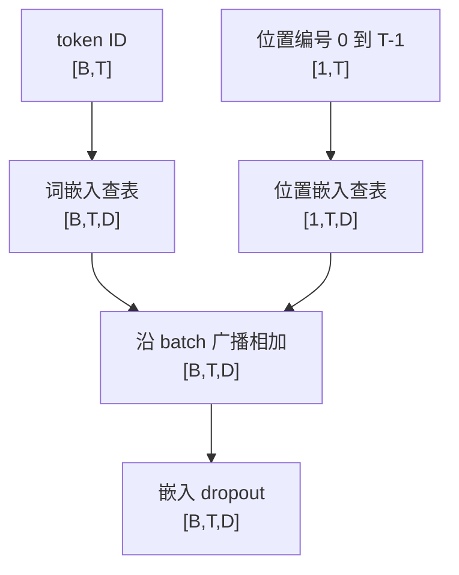
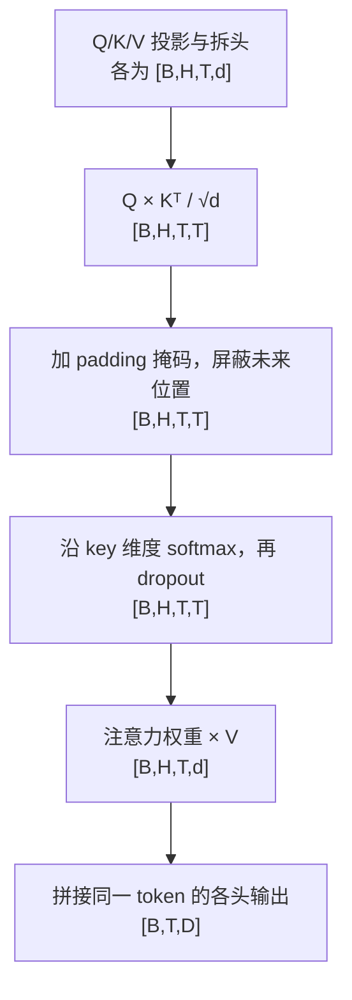

# GPT-2 Learning｜从张量到语言模型

用 PyTorch 逐步实现 GPT-2 的核心计算，并用中文笔记、维度流程图和局部验证脚本记录实现方法。目前已完成**词元与位置嵌入、因果多头自注意力**，覆盖从 token ID 查表到注意力加权汇总的关键步骤。

## 已完成哪些部分

更新：2026-09-25。

| 模块 | 实现方法 | 状态 |
|---|---|---|
| 词元与位置嵌入 | token ID 查词表、位置编号查位置表，广播相加后应用 dropout | 已完成并验证 |
| 因果多头自注意力 | Q/K/V 投影与拆头、缩放点积、padding 与因果掩码、softmax、dropout、V 汇总与合头 | 已完成并验证 |
| Transformer 层 | LayerNorm、残差连接、注意力输出投影与前馈网络 | 下一步 |
| Adam 优化器 | 动量估计、偏差修正与参数更新 | 待实现 |
| 预训练模型对齐 | 加载 GPT-2 权重，对照参考模型输出 | 待开展 |
| 训练与应用 | 分类、复述检测、文本生成及对照实验 | 待开展 |

当前验证以 CPU 小张量为主，完整模型串联和训练将在后续模块完成后进行。

## 实现流程

### 1. 将 token ID 转为含位置信息的向量

[`GPT2Model.embed`](models/gpt2.py) 接收整数索引 `[B,T]`。词嵌入表为每个 ID 提供 D 维向量，位置嵌入表为每个位置提供 D 维向量；两者逐元素相加，再经过嵌入 dropout，输出 `[B,T,D]`。



同一 token ID 使用同一行词向量；不同位置使用不同的位置表行。位置向量在 batch 中共享，相加后特征维度 D 不变。详细推导与数值例子见 [嵌入笔记](GPT2_EMBEDDING_NOTES.md)。

### 2. 用因果多头注意力汇总上下文

[`CausalSelfAttention`](modules/attention.py) 接收 `[B,T,D]` 隐藏表示。三个线性层分别生成 Q、K、V，将 D 拆为 H 个头，每头维度 `d=D/H`，然后执行：



因果掩码确保每个位置只能读取自身和过去；padding 掩码排除补齐的 key。各 batch 行独立计算。详细说明见 [注意力笔记](GPT2_ATTENTION_NOTES.md)。

嵌入输出会先进入 Transformer 层的归一化，再传入注意力模块生成 Q/K/V；这一整层的串联是接下来的实现目标。

## 如何验证

| 脚本 | 检查内容 | 结果 |
|---|---|---|
| [gpt2-first-steps.py](gpt2-first-steps.py) | Q/K/V 投影、拆头形状和基础反向传播 | 通过 |
| [embedding-check.py](embedding-check.py) | 确定数值查表、位置广播、重复 ID、单 token 与最大长度、batch 独立性、精确参数梯度、dropout 行为 | 通过 |
| [attention-check.py](attention-check.py) | 与 PyTorch SDPA 对照输出和梯度，检查因果性、padding、batch 独立性与 dropout | 通过 |

注意力在 CPU `float64` 检查中与参考输出的最大绝对误差为 `2.22e-16`。嵌入验证使用预先设置的表值和独立计算的预期结果，检查重复 ID 与共享位置的梯度累加。以上脚本均使用小张量，无需下载模型权重。

完整模型的 `sanity_check.py` 需要预训练权重，将在 Transformer 等模块完成后运行。

## 运行方式

已验证环境：macOS、Python 3.12、PyTorch 2.8.0、CPU。依赖版本见 [requirements-local.lock.txt](requirements-local.lock.txt)。

首次配置：

```bash
git clone https://github.com/K-I-D-1412/gpt2-learning.git
cd gpt2-learning
python3.12 -m venv .venv
source .venv/bin/activate
python -m pip install -r requirements-local.lock.txt
```

在项目根目录运行：

```bash
export HF_HOME="$PWD/work/huggingface"
.venv/bin/python gpt2-first-steps.py
.venv/bin/python embedding-check.py
.venv/bin/python attention-check.py
```

在 VS Code 中打开项目文件夹，通过 `Python: Select Interpreter` 选择 `.venv/bin/python`，即可编辑并运行脚本。

## 学习资料与代码导航

| 文件 | 内容 |
|---|---|
| [START_HERE.md](START_HERE.md) | 学习路线和环境使用 |
| [GPT2_ATTENTION_NOTES.md](GPT2_ATTENTION_NOTES.md) | batch、Q/K/V、多头注意力与维度流程图 |
| [GPT2_EMBEDDING_NOTES.md](GPT2_EMBEDDING_NOTES.md) | 查表、位置编号、广播相加、dropout 与实现回顾 |
| [LEARNING_STATUS.md](LEARNING_STATUS.md) | 当前进度和下一步 |
| [models/gpt2.py](models/gpt2.py) | 嵌入与模型主体 |
| [modules/attention.py](modules/attention.py) | 因果多头自注意力 |
| [modules/gpt2_layer.py](modules/gpt2_layer.py) | Transformer 层 |
| [optimizer.py](optimizer.py) | Adam 优化器 |

## 来源

项目基于 [cfifty/public_cs224n_gpt](https://github.com/cfifty/public_cs224n_gpt)，起始版本为 [`7570cfa`](https://github.com/cfifty/public_cs224n_gpt/commit/7570cfa4385f3417298573c770df5ddfe2d97f89)。在原有模型框架、Q/K/V 投影与拆头代码上，补全了 `attention()` 和 `embed()`，并新增组件验证与学习笔记。

原始说明见 [docs/UPSTREAM_README.md](docs/UPSTREAM_README.md)，许可证见 [LICENSE](LICENSE)。保留原代码及其 Hugging Face Transformers 来源与版权声明。
