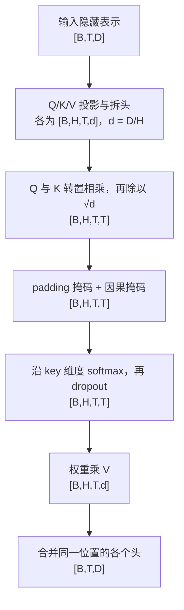

# GPT-2 Learning｜从张量到语言模型

通过亲手实现 GPT-2 核心组件，学习张量运算、注意力、Transformer、训练与生成，为后续 Agent 开发打基础。

本项目基于 [CS224N GPT-2 起始代码](https://github.com/cfifty/public_cs224n_gpt)开展个人自学。当前已完成**因果多头自注意力**，并通过独立参考输出、梯度与行为验证；其余核心模块仍在逐步实现中。这不是一个已经训练好的完整 GPT-2，也不以课程评分、排行榜或提交要求为目标。

## 当前进度

更新：2026-09-24。

| 模块 / 里程碑 | 状态 | 说明 |
|---|---|---|
| 本地学习环境 | 已完成 | Python 3.12、PyTorch 2.8.0，CPU 小张量验证 |
| 张量与 Q/K/V 基础 | 已完成 | batch、线性投影、参数共享、拆头与维度推导 |
| `CausalSelfAttention.attention` | 已完成并验证 | 缩放点积、padding / 因果掩码、softmax、dropout、V 汇总与合头 |
| 学习笔记与流程图 | 已完成 | 从文本到注意力输出，标注每一步的维度 |
| 词元与位置嵌入 | 下一步 | `models/gpt2.py` 中的 `embed` |
| Transformer 层 | 待实现 | 归一化、残差连接与前馈网络 |
| Adam 优化器 | 待实现 | 参数更新及对应验证 |
| 预训练模型对齐 | 待开展 | 核心组件完成后加载权重、比较参考模型 |
| 训练与下游任务 | 待开展 | 分类、复述检测、文本生成及扩展实验 |

目前没有进行模型训练，也没有下载预训练 GPT-2 权重。

## 已完成的注意力实现

输入隐藏表示的形状为 `[B,T,D]`。起始代码已提供 Q/K/V 线性层和拆头操作；本人完成的是 `attention()` 内部计算，最终返回 `[B,T,D]`。



实现文件：[modules/attention.py](modules/attention.py)。详细解释见 [GPT-2 注意力学习笔记](GPT2_ATTENTION_NOTES.md)。

## 快速开始

已在 macOS、Python 3.12、PyTorch 2.8.0 的 CPU 环境验证以下脚本。锁定依赖记录在 [requirements-local.lock.txt](requirements-local.lock.txt)，原课程的 `env.yml` 保留作参考。

首次配置：

```bash
git clone https://github.com/K-I-D-1412/gpt2-learning.git
cd gpt2-learning
python3.12 -m venv .venv
source .venv/bin/activate
python -m pip install -r requirements-local.lock.txt
```

先观察已有投影与拆头，再验证完整注意力：

```bash
.venv/bin/python gpt2-first-steps.py
.venv/bin/python attention-check.py
```

这两个脚本只使用随机小张量，不需要 GPU、数据集下载或预训练模型权重。若本地已经建好 `.venv`，可以直接运行上述两条命令。

在 VS Code 中打开项目文件夹，通过 `Python: Select Interpreter` 选择项目内的 `.venv/bin/python`，打开脚本后使用 Python 扩展的运行按钮即可。

后续需要下载模型时，可将缓存放在项目的忽略目录中：

```bash
export HF_HOME="$PWD/work/huggingface"
```

## 验证范围与结果

[attention-check.py](attention-check.py) 使用 PyTorch 的 `scaled_dot_product_attention` 作为独立数值参考，并检查：

- 不同 batch、序列长度、隐藏维度与头数下的输出，包括单 token 情况。
- 输入与 Q/K/V 参数的梯度有限，且与参考梯度一致。
- 修改未来 token 不影响此前位置的输出。
- 修改被屏蔽的 key 不影响有效 query；专门包含过去位置被屏蔽的情形，避免因果掩码掩盖 padding 错误。
- 不同序列的数据和掩码互不干扰。
- dropout 在训练模式下有随机性，在评估模式下与无 dropout 参考一致。

当前结果：**全部通过**。CPU `float64` 参考输出最大绝对误差为 `2.22e-16`。这是局部组件验证，不代表完整 GPT-2 已通过验证，也不代表模型已获得语言能力。

完整 `sanity_check.py` 需要加载预训练权重，并依赖尚未完成的其他核心模块，留到后续阶段运行；优化器验证同样在实现后进行。

## 学习资料与代码导航

| 文件 | 用途 |
|---|---|
| [START_HERE.md](START_HERE.md) | 学习路线、环境使用和第一课入口 |
| [LEARNING_STATUS.md](LEARNING_STATUS.md) | 已学内容、验证记录和下一步 |
| [GPT2_ATTENTION_NOTES.md](GPT2_ATTENTION_NOTES.md) | batch、初始化、三张完整流程图与维度速查 |
| [AGENTS.md](AGENTS.md) | 自学协作约定：本人写核心代码，助手讲解、提示和检查 |
| [gpt2-first-steps.py](gpt2-first-steps.py) | 观察 Q/K/V 投影与拆头，检查基础反向传播 |
| [attention-check.py](attention-check.py) | 完整注意力模块的局部验证 |
| [modules/attention.py](modules/attention.py) | 已完成的因果多头自注意力 |
| [models/gpt2.py](models/gpt2.py) | 词元与位置嵌入、模型主体，仍有待实现部分 |
| [modules/gpt2_layer.py](modules/gpt2_layer.py) | Transformer 层，待实现 |
| [optimizer.py](optimizer.py) | Adam 优化器，待实现 |

本地虚拟环境、缓存、生成权重与单独下载的课程 PDF 不纳入版本管理。起始代码附带的数据与任务脚本保留，后续按学习进度使用。

## 项目来源与贡献说明

- 起始仓库：[cfifty/public_cs224n_gpt](https://github.com/cfifty/public_cs224n_gpt)。
- 本地学习起点：[`7570cfa4385f3417298573c770df5ddfe2d97f89`](https://github.com/cfifty/public_cs224n_gpt/commit/7570cfa4385f3417298573c770df5ddfe2d97f89)。
- 当前由本人完成的模型核心代码：`CausalSelfAttention.attention`。起始仓库已提供的 Q/K/V 投影层、拆头及其他框架不计为本人从零实现。
- AI 助手用于逐步讲解、代码检查、环境维护、学习笔记和验证脚本；核心模块按本人理解后亲自编写的方式推进。
- 原课程说明保存在 [docs/UPSTREAM_README.md](docs/UPSTREAM_README.md)，其中的课程提交与评分流程仅作为历史资料。
- 原始许可证保留在 [LICENSE](LICENSE)。起始项目的部分代码来自 Hugging Face Transformers，沿用其原有来源与版权声明。

下一学习目标：理解词嵌入查表与位置向量相加，亲自实现 `GPT2Model.embed`。
